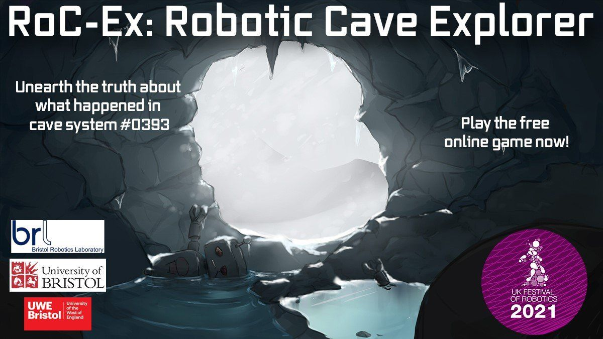

# RoC-eX: Robotic Cave Explorer
**Unearth the truth about what happened in cave system #0393**

Dive into the experience of piloting a robotic scout through what appears to be an ancient cave system leading down to the centre of the Earth. With the help of advanced sensors, guide your robot explorer along dark tunnels and caverns, avoiding obstacles, collecting relics of aeons past and, hopefully, discover what happened to its predecessor. 

We hope playing the game will teach you about how sensors work, how they are used in reality and perhaps give a glimpse into the mind of the robot. With luck, this can show how exciting it can be to work in robotics! 

## Playing the game

The game is currently hosted on [this website](https://www.farscope.bris.ac.uk/game) as part of the [UKRAS festival of Robotics 2021](https://www.ukras.org/robotics-week/)

## Extending the game

This game is build using the [Godot Engine](https://godotengine.org/). Simply clone or download the zip of the project and open up using the godot editor. 

## License
This project is licensed under the MIT License. See [License](License) for further details. We just ask that you link back to the original game! 

## Screenshots

  
   

  
   

## Credits

### Producers
* Mickey Li,
* Julian Hird,
* Gabriella Miles

### Game Development
* Julian Hird,
* Mickey Li,
* Wong Weijie,
* Arturs Elksnis,
* Kirsty Aquilina,
* Peter Wharton,
* Hendrik Eichhorn,
* Zhun Chen Yek,
* Mihai Anca

### Game Design
* Gabriella Miles,
* Valentina Lo Gatto,
* Alex Smith,
* Vimbai Gore-Strachan

### Story
* Gabriella Miles,
* Valentina Lo Gatto,
* Alex Smith,
* Julian Hird

### Modellers
* Gabriella Miles,
* Alex Smith,
* Wong Weijie

### Testing
* Liam Fletcher

### Thanks to
* Paul Harper,
* Michael Secker,
* Aneta Taylor,
* Prof Jonathan Rossiter,
* Claire Asher,
* UKRAS Robotics Festival 2021, ESPRC, FARSCOPE, University of Bristol, University of West England, Bristol Robotics Laboratory
* Made with Godot - godotengine.org/license
